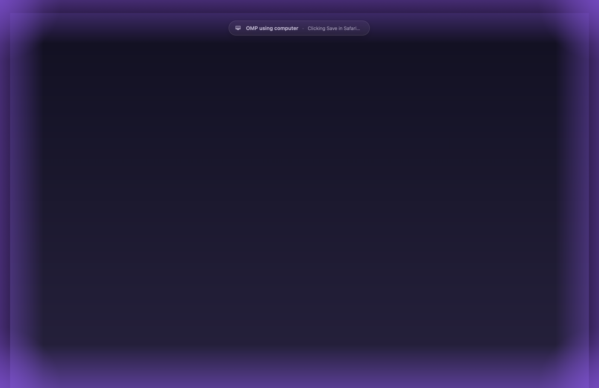
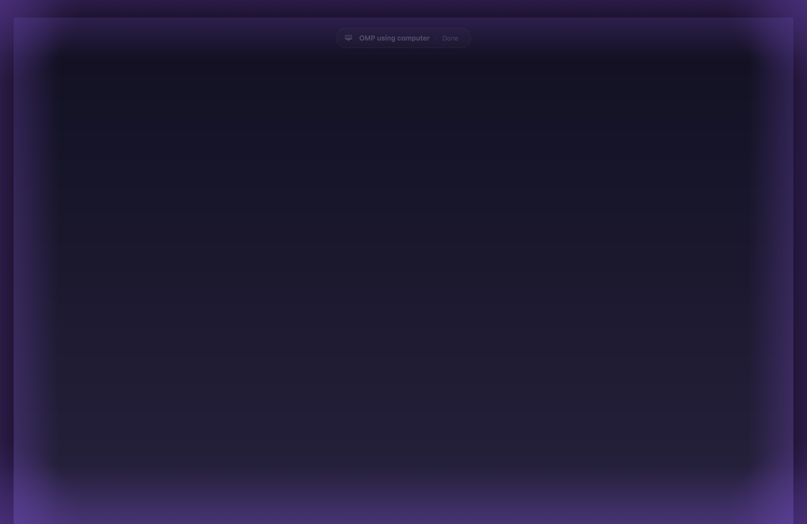

# omp-computer-banner

I use OMP computer use a lot. But when the agent takes over my Mac I had no idea what it was doing. Codex has a nice pill that tells you. So I had one built for OMP.






What you get:

- A small pill below the menu bar. It shows the live step, like Clicking Save in Safari.
- A purple glow around the screen edges while it works. It breathes.
- A white flash every time the agent screenshots.
- When it is done the pill says Done and fades out. It never steals your focus.

The shots above are staged on a fake backdrop. The real thing hides from screenshots on purpose, so I had to fake the scene to show it.

## How this repo was made

I want to be honest here. I directed and engineered all of this. Every behavior was my call. I tested each step live on my screen and tuned it until it felt right. But I did not write the code and I never read it line by line. An NAI coding agent wrote all of it.

So this is not vibe code nobody looked at. I watched everything it does. I just did not read the source.

## Install

You need macOS, OMP, and Xcode Command Line Tools (for swiftc).

```bash
git clone https://github.com/BedirT/omp-computer-banner.git
cd omp-computer-banner
./install.sh
```

Then restart your omp session. Your terminal needs Accessibility and Screen Recording permission. That is for computer use itself, not for my overlay.

Try `/computer-banner` to preview. `/computer-banner-hide` to hide it.

## How it works, short version

Two files. A TypeScript extension watches computer calls and writes the current step to a tiny file. A small Swift app draws the pill and the glow from that file. The agent only sets a title on each call. That is it.

## Settings

The grace period is `QUIET_MS` in the extension. Default is 60s. Run the binary with `--no-glow` if you hate the glow.

## Remove it

```bash
rm -rf ~/.omp/agent/computer-pill ~/.omp/agent/extensions/computer-banner.ts
```

Then delete the `<!-- omp-computer-banner -->` blocks from `~/.omp/agent/AGENTS.md` and `~/.omp/agent/RULES.md`.

## License

MIT, see [LICENSE](LICENSE).
